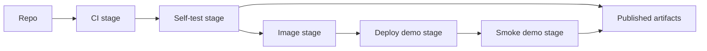
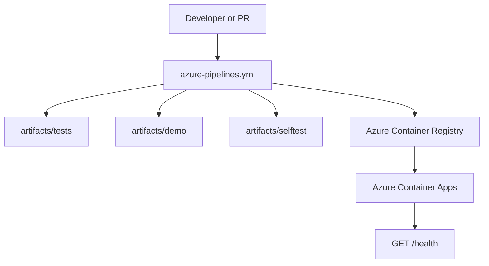
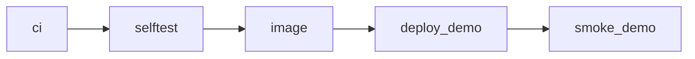
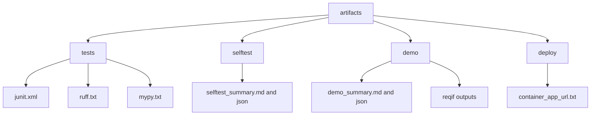
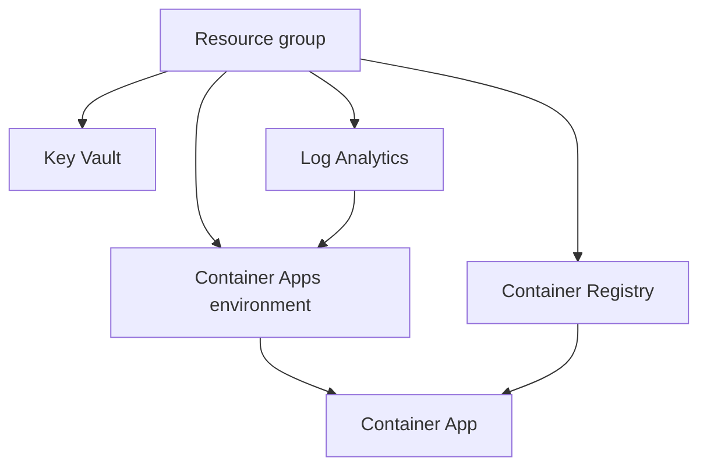

# Azure DevOps Deployment Guide

This repo already contains the pieces needed for Azure DevOps CI, self-test, image build, and demo deployment. This guide explains how the parts fit together and how to run them without reading the pipeline YAML first.

## What This Covers

- CI on Azure Pipelines with `uv`, `just`, `ruff`, `mypy`, and `pytest`
- stable pipeline artifacts under `artifacts/`
- self-test runs that emit derived ReqIF, SARIF, summary JSON, and evidence
- container image build and push to Azure Container Registry
- demo deployment to Azure Container Apps
- smoke testing through the live `/health` endpoint



## Deployment Model

The Azure path is intentionally simple:

- build one container image
- publish one stable artifact tree
- deploy one demo app
- smoke test the running endpoint



## Prerequisites

You need these before enabling deploy stages:

- an Azure DevOps project and pipeline connected to this repo
- an Azure service connection with permission to deploy to the target subscription
- an existing Azure resource group, or permission to create one
- permission to create:
  - Azure Container Registry
  - Azure Container Apps environment and app
  - Log Analytics workspace
  - Key Vault

Repo-side prerequisites:

- `azure-pipelines.yml`
- `ado/templates/`
- `infra/main.bicep`
- `.env.demo.example`
- `Dockerfile`

## Quick Start

### 1. Run the local preflight

This verifies the same command surface the pipeline uses.

```bash
just ci-check
just selftest-suite
just demo-artifacts
```

### 2. Configure Azure DevOps variables

Set these pipeline variables:

| Variable | Purpose | Example |
| --- | --- | --- |
| `azureServiceConnection` | Azure DevOps service connection name | `sc-reqif-opa-demo` |
| `azureResourceGroup` | target resource group | `rg-reqif-opa-demo` |
| `azureLocation` | Azure region | `australiaeast` |
| `acrName` | Azure Container Registry name | `reqifopademoacr` |
| `imageRepository` | repository name inside ACR | `reqif-opa-mcp` |
| `containerAppEnvironmentName` | Container Apps environment | `reqif-opa-demo-env` |
| `containerAppName` | deployed app name | `reqif-opa-mcp-demo` |
| `containerPort` | exposed app port | `8000` |

If `azureServiceConnection` is empty, the deploy stages are skipped and the pipeline behaves as CI plus self-test only. The image/deploy/smoke stages also require a non-empty `acrName` and only run on non–Pull Request builds (i.e., not when `Build.Reason == PullRequest`).

### 3. Run the pipeline in CI and self-test mode

Leave `azureServiceConnection` empty for the first run. This validates:

- dependency restore via `uv`
- CI checks
- self-test outputs
- artifact publishing

### 4. Enable image and deploy stages

Once CI and self-test pass, set `azureServiceConnection` and `acrName` and rerun a non‑PR build (for example, on `main`). In that case, the pipeline will:

- build and push the image to ACR
- deploy or update the Azure Container App
- call `/health`
- publish live smoke artifacts

Pull Request (`Build.Reason == PullRequest`) validation runs will still execute CI and self-test stages only; image, deploy, and smoke stages are skipped for PR builds.

## Pipeline Stages



### `ci`

Defined by `ado/templates/ci.yml`.

Runs:

- `uv sync`
- `just ci-check`
- `uv run ruff check .`
- `uv run mypy reqif_mcp reqif_ingest_cli`

Publishes:

- `artifacts/tests/junit.xml`
- `artifacts/tests/ruff.txt`
- `artifacts/tests/mypy.txt`

### `selftest`

Defined by `ado/templates/selftest.yml`.

Runs:

- `just demo-artifacts "artifacts/demo" "artifacts/selftest" "<enforceGateFailures>"`

This produces:

- derived ReqIF samples
- compliance summaries
- merged SARIF
- evidence outputs
- demo summary files

### `image`

Defined in `azure-pipelines.yml`.

Runs:

- `docker build`
- `docker push`

Tags:

- commit SHA
- `latest`

### `deploy_demo`

Defined by `ado/templates/deploy-container-app.yml`.

Runs:

- `az deployment group create --template-file infra/main.bicep`
- deploys the current image into Azure Container Apps

Publishes:

- `artifacts/deploy/container_app_url.txt`

### `smoke_demo`

Defined in `azure-pipelines.yml`.

Runs:

- resolves the deployed Container App FQDN
- `GET /health`
- stores the live response in `artifacts/demo/live/health.json`

## Artifact Contract

The Azure path depends on stable artifact locations.



Primary locations:

| Path | Contents |
| --- | --- |
| `artifacts/tests/` | JUnit, lint, and typecheck outputs |
| `artifacts/selftest/` | gate outputs, SARIF, evidence, self-test summary |
| `artifacts/demo/` | demo summary plus copied self-test and derived ReqIF outputs |
| `artifacts/deploy/` | deployment metadata such as the live app URL |

See `artifacts/README.md` for the file-level contract.

## Container Runtime

The demo image is now meant to be useful by itself. It packages:

- `reqif_mcp/`
- `reqif_ingest_cli/`
- `agents/`
- `schemas/`
- `samples/`
- `opa-bundles/`

```mermaid
flowchart LR
    IMG[Docker image] --> SERVER[reqif_mcp HTTP server]
    IMG --> INGEST[reqif_ingest_cli]
    IMG --> BUNDLES[OPA bundles]
    IMG --> SAMPLES[tracked samples]
    SERVER --> HEALTH[/health]
```

Container health is based on a real HTTP probe:

- `GET http://127.0.0.1:8000/health`

This is the probe Azure Container Apps and local Docker smoke tests rely on.

## Infrastructure

Infrastructure is defined in `infra/main.bicep`.

Provisioned resources:

- Azure Container Registry
- Key Vault
- Log Analytics workspace
- Container Apps managed environment
- Azure Container App



Current defaults are pragmatic for demos, not hardened production settings:

- ACR uses admin credentials
- Container App scales from zero to one replica
- public ingress is enabled
- deploy stages are conditional on pipeline variables

## Files To Know

| File | Purpose |
| --- | --- |
| `README-azure.md` | top-level Azure DevOps deployment guide |
| `ado/README.md` | concise Azure folder map |
| `azure-pipelines.yml` | stage orchestration |
| `ado/templates/ci.yml` | CI job template |
| `ado/templates/selftest.yml` | self-test and demo artifact template |
| `ado/templates/deploy-container-app.yml` | deployment template |
| `infra/main.bicep` | Azure infrastructure |
| `.env.demo.example` | local and Azure demo settings |
| `artifacts/README.md` | artifact contract |

## Demo Flow

For a live demo, the shortest reliable path is:

1. run `just ci-check`
2. run `just demo-artifacts`
3. run the Azure pipeline with deploy disabled
4. inspect published artifacts
5. enable deploy variables
6. rerun and open the Container App URL from `artifacts/deploy/container_app_url.txt`
7. verify the live health artifact in `artifacts/demo/live/health.json`

## Operational Notes

- self-test enforcement is parameterized; demos can publish artifacts even when the gate surfaces issues
- the self-test stage is useful even without Azure deployment
- the deploy path is intentionally separate from GitHub Actions so Azure DevOps can be evaluated on its own terms
- the current design is container-first and artifact-first; that is what makes demo and review flows predictable

## Recommended Next Hardening Steps

For production use, the next changes should be:

- replace ACR admin credentials with managed identity
- add authenticated ingress or network restriction in front of the app
- publish SARIF into Azure DevOps security tooling if that becomes part of the review workflow
- split demo and production parameter files
- add environment-specific approvals in Azure DevOps Environments

