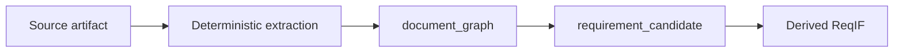
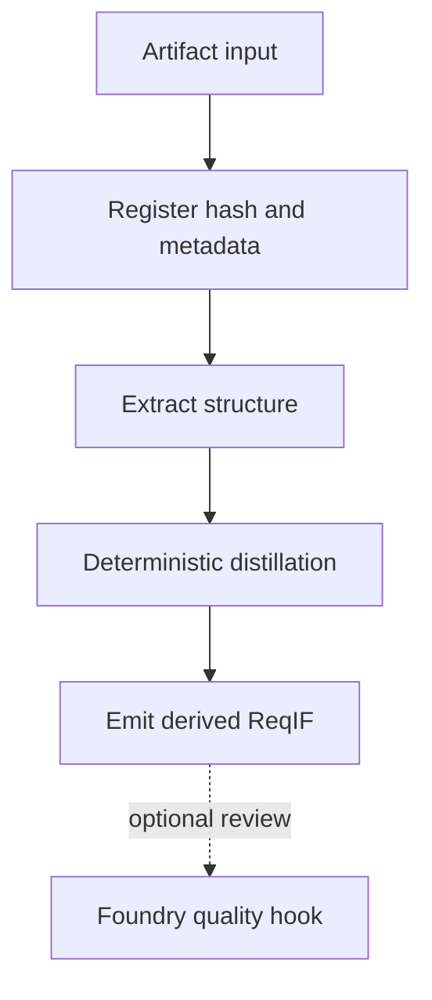
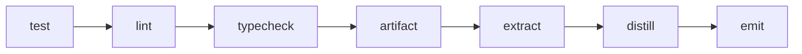
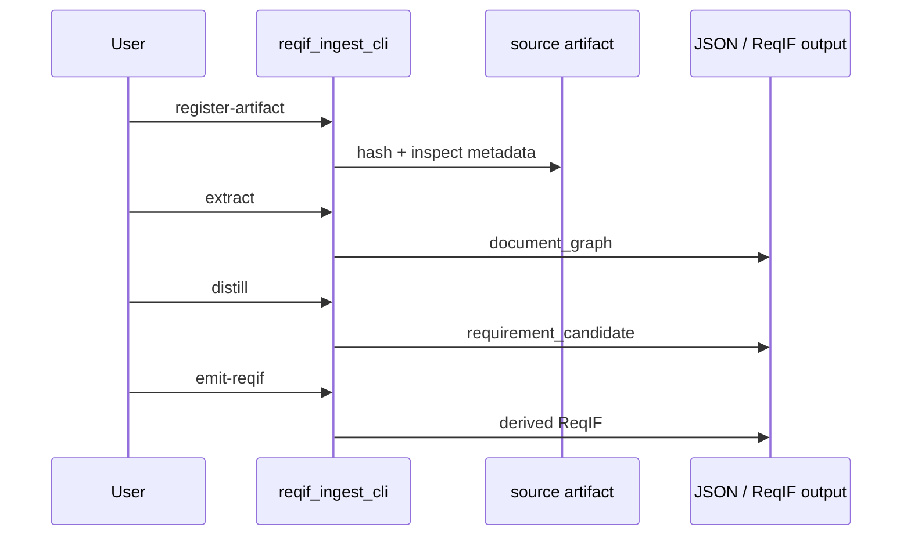
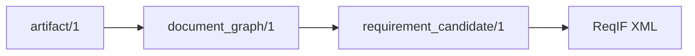
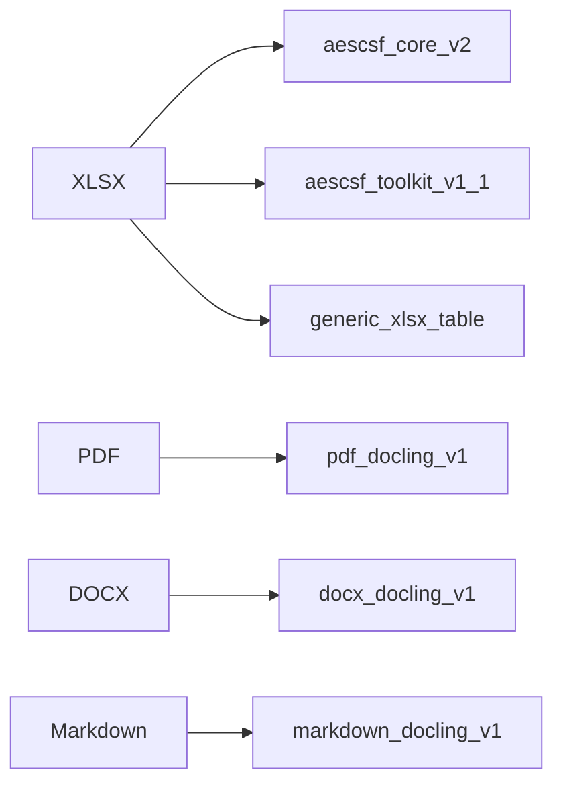
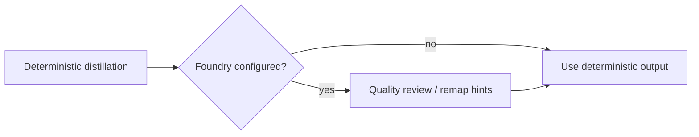
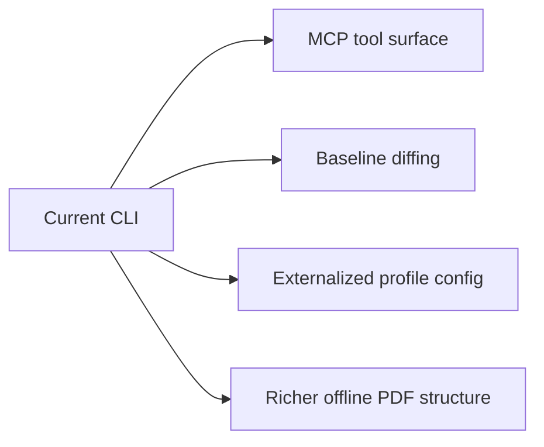

# ReqIF Ingest CLI

This repo now includes a standalone ingestion surface at `reqif_ingest_cli/`.
It keeps source-document intake separate from the existing `reqif_mcp` ReqIF parser and policy server.

Executive view:

- this is the deterministic artifact-to-ReqIF derivation pipeline
- its purpose is traceable extraction, not policy judgement

Engineer view:

- use this surface when the starting point is an artifact such as XLSX, PDF, DOCX, or Markdown
- use `reqif_mcp` when the starting point is already ReqIF



## Scope

- Deterministic first pass only.
- XLSX is first-class and implemented with structural extraction plus row-based distillation.
- DOCX and Markdown extraction route through `docling`.
- PDF extraction uses `pypdf` for offline text-layer PDFs, with `docling` as a richer fallback path.
- ReqIF stays derived: `artifact -> document_graph -> requirement_candidate -> reqif`.
- Optional LLM quality-eval hooks use an Azure Foundry/OpenAI-compatible adapter and are disabled by default.



## Commands

Use the local justfile:

```bash
just -f reqif_ingest_cli/justfile --list
```



Common commands:

```bash
just -f reqif_ingest_cli/justfile test
just -f reqif_ingest_cli/justfile lint
just -f reqif_ingest_cli/justfile typecheck

just -f reqif_ingest_cli/justfile artifact "samples/aemo/The AESCSF v2 Core.xlsx"
just -f reqif_ingest_cli/justfile extract "samples/aemo/The AESCSF v2 Core.xlsx"
just -f reqif_ingest_cli/justfile distill "samples/aemo/The AESCSF v2 Core.xlsx"
just -f reqif_ingest_cli/justfile emit \
  "samples/aemo/The AESCSF v2 Core.xlsx" \
  "evidence_store/toolkits/aemo/aescsf-core.reqif" \
  auto \
  "AESCSF Core Derived Baseline"
```

AESCSF smoke commands for the copied source files:

```bash
just -f reqif_ingest_cli/justfile smoke-aemo-core
just -f reqif_ingest_cli/justfile smoke-aemo-toolkit
```

## CLI

The standalone module runs directly with `uv`:

```bash
uv run python -m reqif_ingest_cli register-artifact "samples/aemo/The AESCSF v2 Core.xlsx" --pretty
uv run python -m reqif_ingest_cli extract "samples/aemo/The AESCSF v2 Core.xlsx" --pretty
uv run python -m reqif_ingest_cli distill "samples/aemo/The AESCSF v2 Core.xlsx" --pretty
uv run python -m reqif_ingest_cli emit-reqif \
  "samples/aemo/The AESCSF v2 Core.xlsx" \
  --title "AESCSF Core Derived Baseline" \
  --output "evidence_store/toolkits/aemo/aescsf-core.reqif" \
  --pretty
uv run python -m reqif_ingest_cli foundry-config --pretty
```



## What It Emits

- `artifact/1`: immutable source hash, media type, file format, source path, profile
- `document_graph/1`: sections, rows, paragraphs, anchors, semantic IDs
- `requirement_candidate/1`: deterministic candidate text, rationale, rule ID, provenance
- ReqIF XML: minimal derived baseline that round-trips through the current parser



See also:

- `samples/README.md`
- `samples/aemo/README.md`
- `samples/contracts/README.md`

## Current Profiles



- `aescsf_core_v2`
  - Detects the flat AESCSF core workbook layout.
  - Preserves paragraph chunks inside `Context and Guidance`.
- `aescsf_toolkit_v1_1`
  - Detects the multi-sheet assessment toolkit layout.
  - Extracts practice rows, objective metadata, MIL/SP, and guidance paragraphs.
- `generic_xlsx_table`
  - Uses header-row detection for other workbooks.
- `pdf_docling_v1`
  - Prefer `pypdf` for offline text-layer extraction.
  - Fall back to `docling` when richer PDF structure is available.
  - Distill paragraphs containing normative modal verbs.
- `docx_docling_v1`, `markdown_docling_v1`
  - Extract with `docling`.
  - Distill paragraphs containing normative modal verbs.

## Optional Foundry Hook

If you want gated quality review after deterministic extraction, set:

```bash
export REQIF_INGEST_FOUNDRY_ENDPOINT="https://<resource>.services.ai.azure.com/models"
export REQIF_INGEST_FOUNDRY_API_KEY="..."
export REQIF_INGEST_FOUNDRY_MODEL="gpt-4.1-mini"
```

Then inspect status with:

```bash
uv run python -m reqif_ingest_cli foundry-config --pretty
```

The adapter is for review and remapping only. It is not part of the deterministic first pass.



## Current Gaps

- no baseline diff command yet
- no ingest MCP tool surface yet
- AESCSF mappings are still code-first rather than externalized config
- rich PDF structure extraction still depends on offline Docling model availability


