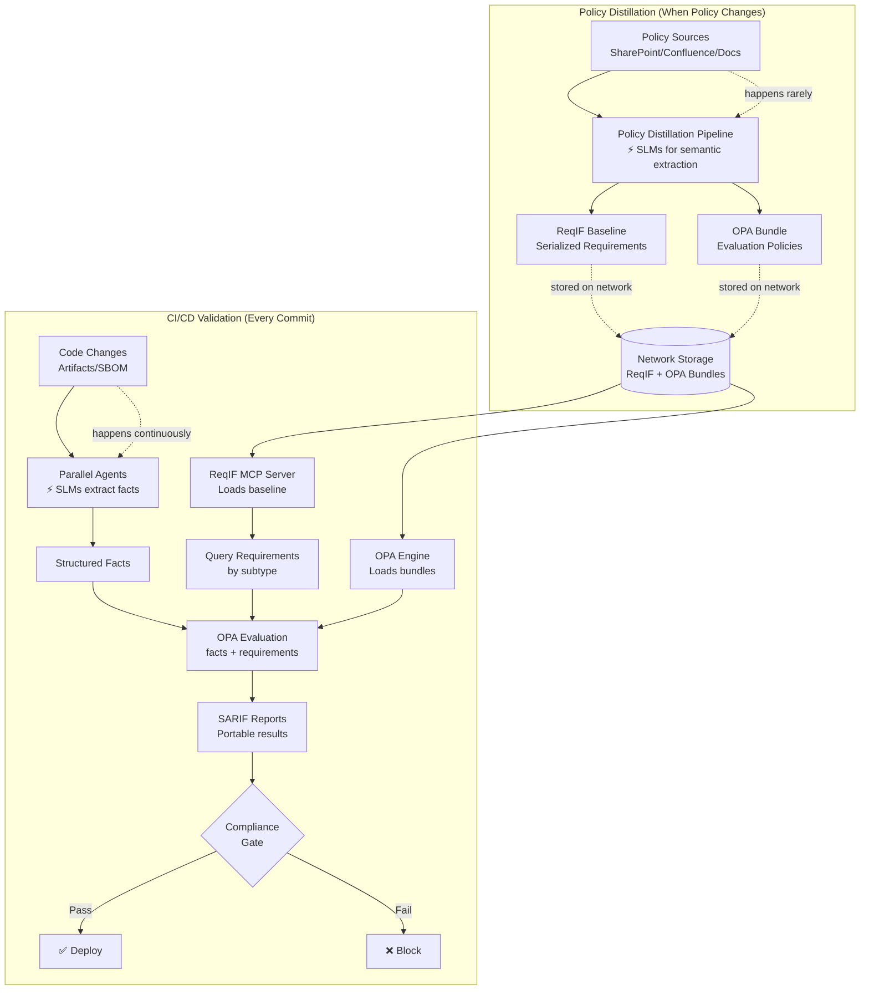
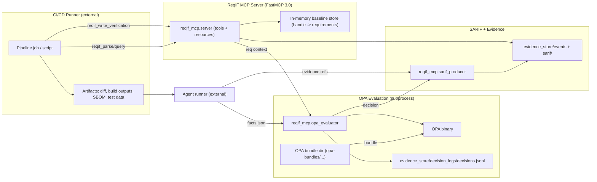
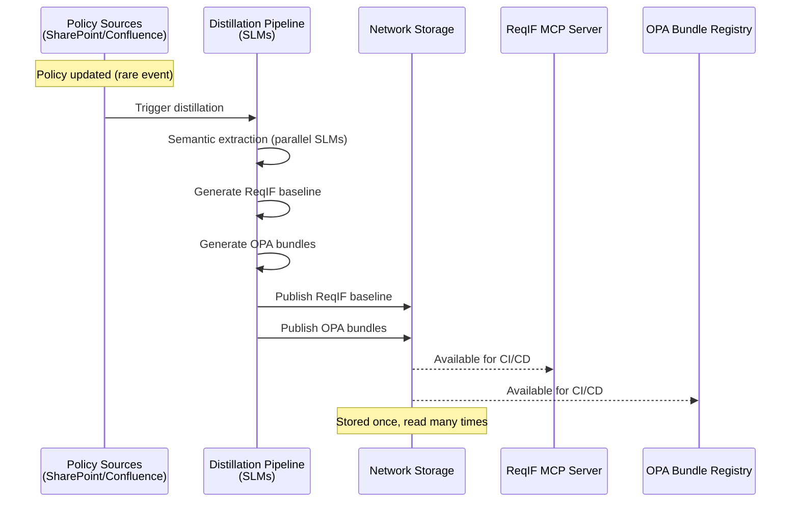
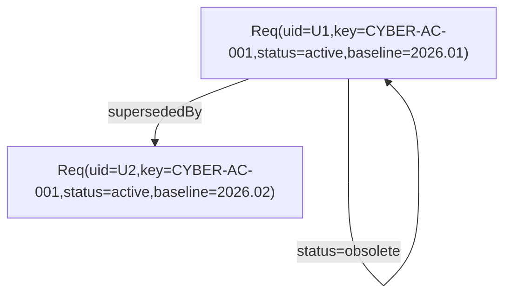

<div align="center">
  <pre>
╔════════════════════════════════════════════════════════════════════╗
║             ReqIF  →  OPA  →  SARIF  Compliance Gate              ║
╚════════════════════════════════════════════════════════════════════╝
  </pre>
  <p><em>Spec-driven, standards-first compliance automation with auditable, portable reporting.</em></p>
</div>

<div align="center">
  <table>
    <tr>
      <td><strong>Purpose</strong><br/>Turn requirements into deterministic gates with traceable evidence.</td>
      <td><strong>Core Stack</strong><br/>ReqIF + OPA + SARIF + FastMCP.</td>
      <td><strong>Audience</strong><br/>CI/CD, security, compliance, and platform teams.</td>
    </tr>
  </table>
</div>

---

## The Big Picture: Policy Distillation → Parallelized Assurance

This system separates **policy authoring** (happens rarely) from **policy validation** (happens continuously in CI/CD).



**Key Concepts:**

1. **Policy Distillation** (upstream, future scope):
   - Triggered ONLY when policy sources change
   - SLMs perform semantic extraction into ReqIF requirements
   - Output: ReqIF baseline + OPA bundles stored on network
   - Many requirement sets processed in parallel
   - *Will be integrated into this repo before MVP release*

2. **Parallelized Validation** (this repo, current scope):
   - CI/CD reads pre-distilled requirements from network storage
   - Multiple agents run in parallel using SLMs (not LLMs)
   - Each agent extracts facts for specific requirement subtypes
   - OPA evaluates facts against pre-compiled policies
   - Deterministic, fast, auditable

3. **Cognitive Assurance at Scale**:
   - Organization maintains many requirement sets (security, safety, compliance)
   - Each set validated independently and in parallel
   - Results aggregated via SARIF for holistic gate decisions

---

## The Premise (Why This Exists)

Compliance is too often a PDF and a hope. This repo turns requirement text into **machine-enforceable policy**, then emits **portable SARIF** results that every pipeline can read. It is intentionally standards-first: ReqIF for requirements, OPA for decisions, SARIF for results, and decision logs for auditability.

## How to Read This Repo

This project is both a system and a playbook. If you are here to understand *capabilities* without reading Python, start with the contracts and the standards mapping below. If you are here to **build or extend**, you will want the agent conventions.

<table>
  <tr>
    <td><strong>Start Here</strong></td>
    <td>
      <ul>
        <li><strong>Data contracts</strong> define the ReqIF, facts, OPA inputs, and SARIF output formats.</li>
        <li><strong>Architecture</strong> shows how agents, OPA, and the MCP server interlock.</li>
        <li><strong>Evidence store</strong> preserves traceability for audits.</li>
      </ul>
    </td>
  </tr>
  <tr>
    <td><strong>Agent Rules</strong></td>
    <td>
      The repository uses a strict agent style guide (a.k.a. “b00t syntax”): ruff only, PEP 484 typing, uv/uvx, FastMCP, and explicit error handling. See <a href="AGENTS.md"><strong>AGENTS.md</strong></a> before making changes.
    </td>
  </tr>
</table>

## What You Get

**Deterministic gates** from OPA, **standards-compliant SARIF** for CI/CD ingestion, and **evidence-linked traceability** back to each requirement UID.

---

## Normative Standards / Formats

- **ReqIF 1.2** - Requirements interchange (XML)
- **SARIF v2.1.0** (OASIS Standard) - Static analysis results interchange
- **OPA policy bundles** - Policy+data distribution (optional signatures)
- **OPA decision logs** - Auditable record of each policy query
- **OPA in CI/CD** - Policy-as-code gates
- **FastMCP 3.0** - Server scaffolding + HTTP transport + versioned resources

## Opinionated Ecosystem

- **GitOps/CI** produces artifacts (code diff, build outputs, infra manifests, SBOM, test reports)
- **Deterministic compliance** = OPA; **semantic extraction** = agent skills
- **Compliance UI + interchange** = SARIF (primary), plus OPA decision logs (audit), plus ReqIF trace links (governance)

## System Objective

**Given:**
- Requirements (ReqIF) with subtype(s) and evaluation rubric references
- A target (commit/changeset/build artifact)
- Agent-produced structured facts

**Produce:**
- OPA decision(s) (deterministic)
- SARIF run(s) (portable reporting)
- Traceable verification evidence linked to requirement UID and target revision
- Repeatable gates suitable for CI/CD

## High-Level Architecture


## Responsibilities (Strict Separation)

### ReqIF MCP Server (Authority)
- Parse/validate ReqIF
- Maintain requirement lifecycle: versions, status (active/obsolete), supersession links
- Serve requirement subsets by subtype, policy baseline, and scope
- Accept verification events and attach trace links

### OPA (Deterministic Gate)
- Evaluate rubric rules against facts + requirement metadata
- Return structured decision object (not just allow/deny)
- Emit decision logs for audit
- Consume policies/data via bundles (+ signatures if required)

### Agents (Semantic/Heuristic)
- Turn changeset/build artifacts into typed facts
- Never decide pass/fail directly; only produce facts + evidence pointers

### SARIF Producer (Report Interoperability)
- Translate: requirement ↔ rule, evaluation ↔ result
- Primary output format for CI ingestion and aggregation

## Data Contracts (Normative)

### Requirement Record (server output)

Minimal normalized JSON (schema `reqif-mcp/1`):

```json
{
  "uid": "uuid|ulid|reqif-identifier",
  "key": "CYBER-AC-001",
  "subtypes": ["CYBER","ACCESS_CONTROL"],
  "status": "active|obsolete|draft",
  "policy_baseline": {"id":"POL-2026.01","version":"2026.01","hash":"..."},
  "rubrics": [{"engine":"opa","bundle":"org/cyber","package":"cyber.access_control.v3","rule":"decision"}],
  "text": "requirement statement",
  "attrs": {"severity":"high","owner":"...","verify_method":"analysis|test|inspection|demo"}
}
```

### Agent Facts (OPA input)

Schema `facts/1` (typed, evidence-addressable):

```json
{
  "target": {"repo":"...","commit":"...","build":"..."},
  "facts": {
    "uses_crypto_library": true,
    "inputs_validated": [{"path":"src/x.rs","line":44,"kind":"missing"}],
    "sbom": {"cyclonedx_ref":"..."},
    "diff_summary": {"files_changed": 12}
  },
  "evidence": [
    {"type":"code_span","uri":"repo://.../src/x.rs","startLine":40,"endLine":55},
    {"type":"artifact","uri":"artifact://sbom.cdx.json","hash":"sha256:..."}
  ],
  "agent": {"name":"cyber-agent","version":"x.y","rubric_hint":"cyber.access_control.v3"}
}

### OPA Evaluation Input (composed)

OPA input = { requirement, facts, context }.

OPA output MUST be:

{
  "status": "pass|fail|conditional_pass|inconclusive|not_applicable|blocked|waived",
  "score": 0.0,
  "confidence": 0.0,
  "criteria": [
    {"id":"AC-1","status":"pass|fail|na","weight":3,"message":"...","evidence":[0,2]}
  ],
  "reasons": ["..."],
  "policy": {"bundle":"org/cyber","revision":"...", "hash":"..."}
}


Decision logs MUST be enabled for audit.

### SARIF Output Mapping (normative)

One SARIF run per pipeline evaluation unit (e.g., per subtype or per rubric bundle).

SARIF tool.driver.name = rubric bundle ID.

SARIF rule.id = requirement uid OR stable key (choose one; MUST be stable).

SARIF result.level mapping:

pass → omit result (preferred) OR note

conditional_pass → warning

fail → error

inconclusive|blocked → warning + property triage=needed

not_applicable → omit result

SARIF result.message = concise reason(s).

Evidence pointers:

result.locations[] from code spans/artifacts where available.

SARIF properties MUST carry:

requirement_uid, requirement_key, subtypes[], policy_baseline.version, opa.policy.hash, agent.version.

SARIF is the standard interchange for static analysis results.

## Workflows

### Policy Distillation → Requirements Publication

**Upstream process (future scope, will be in this repo before MVP):**



**Key Points:**
- Distillation runs ONLY when source policies change
- Many requirement sets processed in parallel
- SLMs extract semantic requirements from unstructured sources
- Output stored on network for CI/CD consumption
- Enables parallelized cognitive assurance at scale

### CI/CD Evaluation Gate


### Requirement Lifecycle (supersession, obsolescence)
Conceptual lifecycle metadata (supersession not persisted by server yet).


## Gate Criteria Model (beyond pass/fail)

Status set (closed):

pass

fail

conditional_pass

inconclusive

blocked (missing artifacts / insufficient facts)

not_applicable

waived (explicit exception with approval ref)

Quantities (optional, but supported):

score ∈ [0,1] (weighted rubric)

confidence ∈ [0,1] (agent quality + evidence strength)

coverage ∈ [0,1] (criteria evaluated / criteria total)

severity ∈ {low,med,high,critical} (requirement attribute)

Gate policies (OPA-level, separate from rubric):

Block release if any fail for severity>=high

Block if coverage < threshold

Block if any blocked for required subtypes

Allow conditional_pass for non-critical, but annotate SARIF

OPA is explicitly used as CI/CD guardrails.

## FastMCP 3.0 Server Surface (normative)

Transport:

HTTP (streamable) for multi-client CI usage.

STDIO optional for local/dev.

Core tools (MVP):

reqif_parse(xml_b64) -> handle

reqif_validate(handle, mode=basic|strict) -> report

reqif_query(where, baseline, subtypes[], status, limit, offset) -> req[]

reqif_write_verification(event) -> ok

reqif_export_req_set(format=json|arrow_ipc|parquet_ref) -> artifact_ref

Resources (versioned):

reqif://baseline/{id} (returns metadata + hashes)

reqif://requirement/{uid}

FastMCP 3.0 provides tools, HTTP transport, and versioned resources.

## OPA Integration (normative)

Policy distribution:

OPA bundles, optionally signed.

Bundle contains:

policy/*.rego

data/*.json (optional lookup tables, thresholds, subtype maps)

Evaluation endpoint:

Local opa eval or OPA REST API (implementation choice).

Input must include policy.bundle hash/revision (for provenance).

Audit:

Decision logs enabled; shipped to evidence store.

## Evidence Storage (OSS-first)

Authoritative vs derived:

Authority: ReqIF XML + requirement graph.

Evidence: append-only event log + columnar projections.

Required stores:

JSONL event log (append-only)

Parquet (partitioned by date/subtype/baseline) for analytics

SARIF artifacts saved verbatim

(Arrow/Parquet are implementation choices; contract is "tabular + immutable events".)

### Log Rotation Strategy (decision logs)

Decision logs are written to evidence_store/decision_logs/decisions.jsonl as an append-only JSONL file.

Log rotation strategy (for production deployment):

Manual rotation: Use external log rotation tools (logrotate, systemd, or cloud-native solutions)

Rotation schedule: Daily or when log file exceeds size threshold (e.g., 100MB)

Compressed archives: After rotation, compress with gzip or similar (decisions.jsonl.2026-01-31.gz)

Retention policy: Keep compressed logs for audit period (e.g., 7 years for compliance)

Naming convention: decisions.jsonl.<date>.gz for archived logs

For MVP: Decision logs are written to single file without automatic rotation. Production deployments should configure external rotation tools.

Decision logs are immutable audit trail - never modify or delete logs without governance approval.

## Test Specification (must be implemented)
### Unit Tests

ReqIF parse/validate:

well-formed, invalid refs, datatype mismatch.

Query correctness:

subtype filter, baseline filter, status filter, pagination determinism.

Lifecycle:

supersession graph invariants.

### OPA Policy Tests (bundle-contained)

For each rubric package:

golden inputs → expected {status, criteria[], score}.

Gate policy tests:

mixtures of results → expected release decision.

(OPA supports CI/CD usage and is typically policy-tested; bundle testing is standard practice in the ecosystem.)

### Integration Tests

End-to-end:

seed ReqIF baseline

run agent stub to emit facts

run OPA with bundle

produce SARIF

write verification event

assert trace links and artifact hashes

### SARIF Conformance Tests

Validate SARIF against SARIF v2.1.0 schema (use an OSS validator).

Verify mapping invariants:

each failing criterion emits result.level=error

rule ids stable

locations present when evidence has code spans

SARIF is standardized; conformance is testable.

## Minimal Deliverables (MVP)

FastMCP 3.0 ReqIF MCP server with tools/resources above.

OPA bundle template:

rubric package per subtype

gate policy package

bundle metadata & optional signatures.

Agent runner contract (facts/1) + stub agent.

SARIF producer implementing the normative mapping.

Test suite: unit + opa policy tests + integration + sarif validation.
