<div align="center">
  <pre>
╔════════════════════════════════════════════════════════════════════╗
║             ReqIF  ->  OPA  ->  SARIF  Compliance Gate            ║
╚════════════════════════════════════════════════════════════════════╝
  </pre>
  <p><em>Deterministic requirements ingestion and policy evaluation with traceable evidence.</em></p>
</div>

## Status

Executive view:

- This repo turns governed source artifacts into traceable compliance decisions.
- It keeps extraction deterministic, keeps ReqIF derived, and keeps policy judgement in OPA.

Engineer view:

- There are two active surfaces: `reqif_mcp/` for ReqIF-centric gate operations and `reqif_ingest_cli/` for source-to-ReqIF derivation.

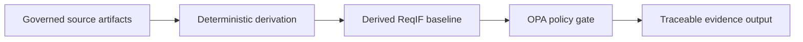
```mermaid
flowchart LR
    SRC[Governed source artifacts] --> DERIVE[Deterministic derivation]
    DERIVE --> REQIF[Derived ReqIF baseline]
    REQIF --> OPA[OPA policy gate]
    OPA --> EVIDENCE[Traceable evidence output]
```

Surface summary:

- `reqif_mcp/`
  - FastMCP server for parsing, validating, querying, and evaluating existing ReqIF baselines.
  - Verification events and decision logs are written to the evidence store.
- `reqif_ingest_cli/`
  - Standalone deterministic ingestion pipeline for source artifacts.
  - First-class XLSX support, offline PDF text extraction, derived ReqIF emission, and optional Azure Foundry review hooks.

What exists today:

- ReqIF parse/normalize/query/verification via MCP
- Deterministic source-to-ReqIF derivation for XLSX, text-layer PDF, DOCX, and Markdown
- Standards sample baselines for OWASP ASVS and NIST SSDF dogfooding
- Selective compliance-gate filtering by requirement key, attribute, text fragment, or limit
- Typed test coverage for parser, normalization, SARIF mapping, compliance gate, and ingest

What is still future work:

- ingest surfaced as MCP tools
- normalized diffing between successive source versions
- persistent baseline storage beyond in-memory handles
- richer PDF structure extraction with pre-seeded offline Docling models
- externalized profile/config mapping instead of code-first profile logic

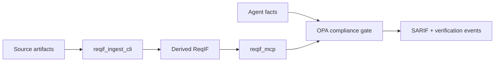
```mermaid
flowchart LR
    SRC[Source artifacts] --> ING[reqif_ingest_cli]
    ING --> REQIF[Derived ReqIF]
    REQIF --> MCP[reqif_mcp]
    FACTS[Agent facts] --> GATE[OPA compliance gate]
    MCP --> GATE
    GATE --> OUT[SARIF + verification events]
```

## Architecture

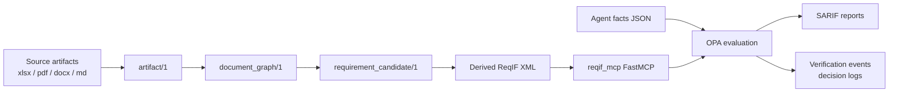
```mermaid
flowchart LR
    S[Source artifacts<br/>xlsx / pdf / docx / md] --> A[artifact/1]
    A --> G[document_graph/1]
    G --> C[requirement_candidate/1]
    C --> R[Derived ReqIF XML]

    R --> M[reqif_mcp FastMCP]
    F[Agent facts JSON] --> O[OPA evaluation]
    M --> O
    O --> SARIF[SARIF reports]
    O --> LOGS[Verification events<br/>decision logs]
```

The boundary is deliberate:

- ingestion is standalone and deterministic first
- ReqIF remains a derived artifact
- agents produce facts, not pass/fail decisions
- OPA remains the gate and policy authority

## Gate Criteria Model (beyond pass/fail)

The compliance gate is not a single boolean check. It evaluates three layers:

- `meta_policy`
  - baseline sanity, subtype selection, filter results, facts shape, and bundle/package alignment
- `processing`
  - OPA execution, SARIF generation, verification-event writes, and other runtime failures
- `policy`
  - the actual requirement decision returned by OPA

Each OPA decision carries:

- overall `status`
- weighted `criteria[]`
- human-readable `reasons[]`
- policy provenance in `policy`

```mermaid
flowchart TD
    R[Selected requirement] --> MP{Meta-policy valid?}
    MP -- no --> MFAIL[Hard gate failure<br/>EMPTY_BASELINE / EMPTY_SELECTION / etc.]
    MP -- yes --> OPA[OPA decision]
    OPA --> CRIT[criteria[] + reasons[] + policy provenance]
    CRIT --> PROC{Processing healthy?}
    PROC -- no --> PFAIL[Hard gate failure<br/>OPA / SARIF / verification error]
    PROC -- yes --> DEC{Decision status}
    DEC -- fail/high severity --> GFAIL[Gate failure]
    DEC -- pass or acceptable --> GPASS[Gate passes]
    DEC -- conditional / blocked / inconclusive --> GREVIEW[Review path]
```

Useful filter controls when dogfooding or triaging:

- `--requirement-key`
- `--attribute-filter`
- `--text-contains`
- `--limit`

## Quick Start

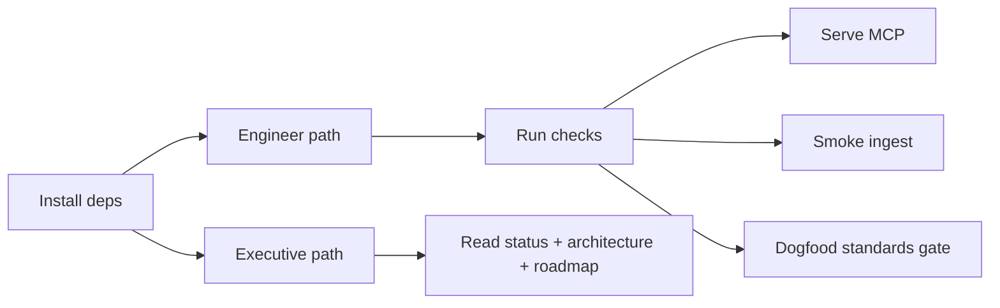
```mermaid
flowchart LR
    A[Install deps] --> B[Engineer path]
    A --> X[Executive path]
    B --> C[Run checks]
    C --> D[Serve MCP]
    C --> E[Smoke ingest]
    C --> F[Dogfood standards gate]
    X --> G[Read status + architecture + roadmap]
```

Root repo:

```bash
just install
just check
just serve
```

Ingest and derived ReqIF smoke:

```bash
just -f reqif_ingest_cli/justfile check
just dogfood-ingest
```

Security standards dogfood:

```bash
just dogfood-asvs
just dogfood-asvs-cwe CWE-20
just dogfood-ssdf
```

Emit a derived ReqIF from the tracked AESCSF core workbook:

```bash
uv run python -m reqif_ingest_cli emit-reqif \
  "samples/aemo/The AESCSF v2 Core.xlsx" \
  --title "AESCSF Core Derived Baseline" \
  --output "/tmp/aescsf-core.reqif" \
  --pretty
```

## Repo Map

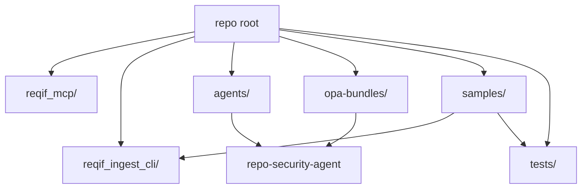
```mermaid
flowchart TD
    ROOT[repo root] --> MCP[reqif_mcp/]
    ROOT --> ING[reqif_ingest_cli/]
    ROOT --> AGENTS[agents/]
    ROOT --> BUNDLES[opa-bundles/]
    ROOT --> SAMPLES[samples/]
    ROOT --> TESTS[tests/]

    AGENTS --> GATE[repo-security-agent]
    BUNDLES --> GATE
    SAMPLES --> ING
    SAMPLES --> TESTS
```

- `reqif_mcp/` - FastMCP server and current ReqIF evaluation surface
- `reqif_ingest_cli/` - deterministic artifact intake, extraction, distillation, and ReqIF emission
- `agents/` - deterministic facts producers, including repo-security dogfooding
- `opa-bundles/` - example and standards sample policy bundles
- `samples/` - tracked source artifacts, contracts, and standards fixtures
- `tests/` - parser, normalization, SARIF, gate, and ingest tests

## ReqIF MCP Server

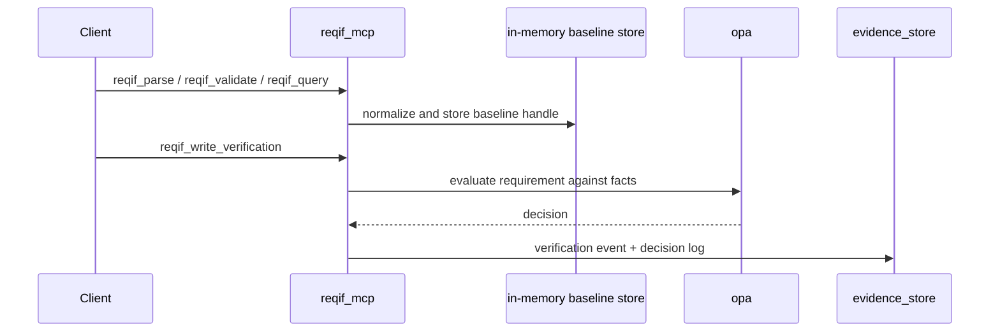
```mermaid
sequenceDiagram
    participant Client
    participant MCP as reqif_mcp
    participant Store as in-memory baseline store
    participant OPA as opa
    participant Evidence as evidence_store

    Client->>MCP: reqif_parse / reqif_validate / reqif_query
    MCP->>Store: normalize and store baseline handle
    Client->>MCP: reqif_write_verification
    MCP->>OPA: evaluate requirement against facts
    OPA-->>MCP: decision
    MCP->>Evidence: verification event + decision log
```

Current tool surface in `reqif_mcp/server.py`:

- `reqif_parse`
- `reqif_validate`
- `reqif_query`
- `reqif_export_req_set`
- `reqif_write_verification`

Current implementation notes:

- baselines are stored in memory by handle
- ReqIF is accepted as base64 XML input
- HTTP and STDIO transports are supported
- evaluation and evidence are separate from ingestion

## Standalone Ingest CLI

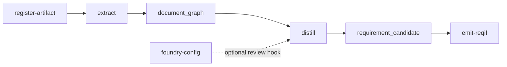
```mermaid
flowchart LR
    REG[register-artifact] --> EXT[extract]
    EXT --> DG[document_graph]
    DG --> DIST[distill]
    DIST --> RC[requirement_candidate]
    RC --> EMIT[emit-reqif]
    CFG[foundry-config] -. optional review hook .-> DIST
```

Available commands in `reqif_ingest_cli/__main__.py`:

- `register-artifact`
- `extract`
- `distill`
- `emit-reqif`
- `foundry-config`

Current extraction profiles:

- `aescsf_core_v2`
- `aescsf_toolkit_v1_1`
- `generic_xlsx_table`
- `pdf_docling_v1`
- `docx_docling_v1`
- `markdown_docling_v1`

Current implementation notes:

- XLSX is first-class and deterministic
- PDF prefers `pypdf` for offline text-layer extraction
- `docling` remains the richer path for DOCX and Markdown
- Azure Foundry integration is optional and not part of the deterministic first pass

See `README-reqif-ingest-cli.md` for command details.

## Samples and Fixtures

The main README now links to sample indexes instead of carrying inline sample payloads.

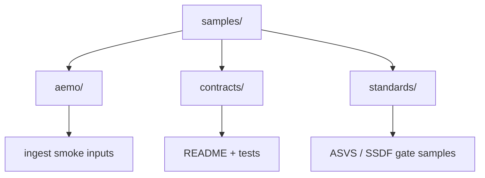
```mermaid
flowchart TD
    S[samples/] --> A[aemo/]
    S --> C[contracts/]
    S --> ST[standards/]

    A --> ING[ingest smoke inputs]
    C --> DOCS[README + tests]
    ST --> DOGFOOD[ASVS / SSDF gate samples]
```

Start here:

- `samples/README.md` - sample inventory and navigation
- `samples/aemo/README.md` - tracked AEMO source artifacts used by ingest
- `samples/contracts/README.md` - JSON contracts referenced by docs and tests
- `samples/standards/README.md` - upstream standards material and derived dogfood baselines

## Dogfooding With GitHub and Copilot

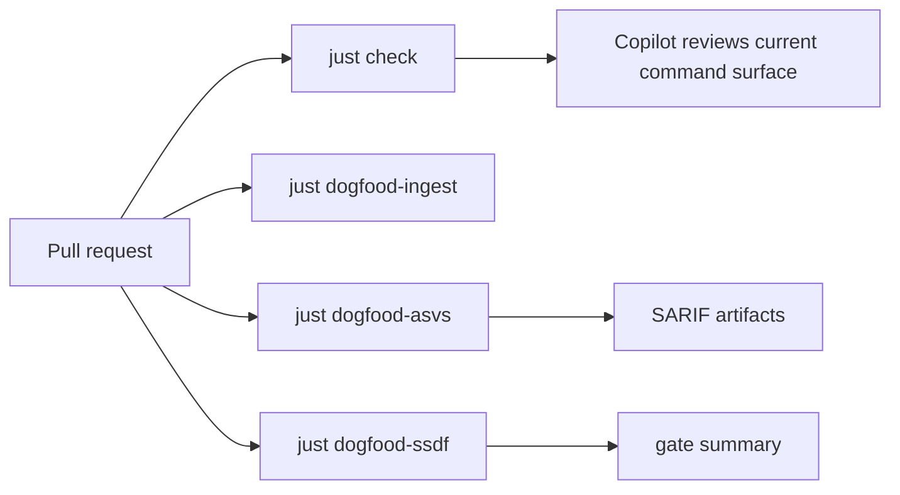
```mermaid
flowchart LR
    PR[Pull request] --> QC[just check]
    PR --> INGEST[just dogfood-ingest]
    PR --> ASVS[just dogfood-asvs]
    PR --> SSDF[just dogfood-ssdf]
    ASVS --> SARIF[SARIF artifacts]
    SSDF --> SUMMARY[gate summary]
    QC --> COPILOT[Copilot reviews current command surface]
```

Recommended CI/CD workflow shape for this repo:

- pull request quality gate
  - run `just check`
  - run `just check-ingest`
  - fail fast on parser, schema, or ingest regressions
- sample artifact smoke run
  - trigger when `samples/**`, `reqif_ingest_cli/**`, or `README-reqif-ingest-cli.md` changes
  - emit derived ReqIF from the tracked AESCSF workbooks
  - upload the derived ReqIF as a build artifact for review
- security standards dogfood
  - trigger when `reqif_mcp/**`, `opa-bundles/**`, `agents/**`, or `samples/standards/**` changes
  - evaluate repo facts against OWASP ASVS and NIST SSDF sample bundles
  - upload gate summaries and SARIF artifacts
- baseline drift check
  - trigger on changes to tracked source documents
  - emit ReqIF and compare normalized requirements against the last known baseline

Recommended Copilot usage in this repo:

- treat `justfile` and `reqif_ingest_cli/justfile` as the public command surface
- reuse `samples/contracts/*.json` rather than inventing ad hoc JSON examples
- update tests first when changing parser, gate, or ingest behavior
- keep raw ReqIF XML generation behind the emitter instead of hand-editing XML

## Data Contracts

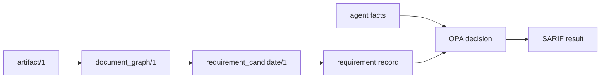
```mermaid
flowchart LR
    ART[artifact/1] --> DG[document_graph/1]
    DG --> CAND[requirement_candidate/1]
    CAND --> REQ[requirement record]
    FACTS[agent facts] --> OPA[OPA decision]
    REQ --> OPA
    OPA --> SARIF[SARIF result]
```

Use the tracked sample files instead of copying large JSON blobs into the README:

- `samples/contracts/requirement-record.example.json`
- `samples/contracts/requirement-candidate.example.json`
- `samples/contracts/agent-facts.example.json`
- `samples/contracts/opa-output.example.json`

Contract descriptions and file-level notes live in `samples/contracts/README.md`.

## Standards and Formats

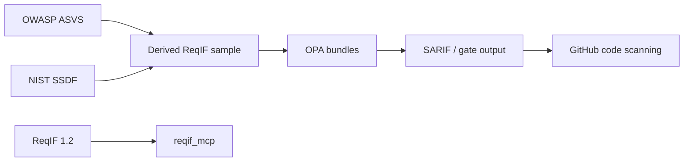
```mermaid
flowchart LR
    ASVS[OWASP ASVS] --> SREQ[Derived ReqIF sample]
    SSDF[NIST SSDF] --> SREQ
    SREQ --> OPA[OPA bundles]
    OPA --> SARIF[SARIF / gate output]
    REQIF[ReqIF 1.2] --> MCP[reqif_mcp]
    SARIF --> GITHUB[GitHub code scanning]
```

Implemented and tracked here:

- ReqIF 1.2
- SARIF v2.1.0
- OPA bundles and decision logs
- FastMCP
- OWASP ASVS sample baseline and bundle
- NIST SSDF sample baseline and bundle

## Roadmap

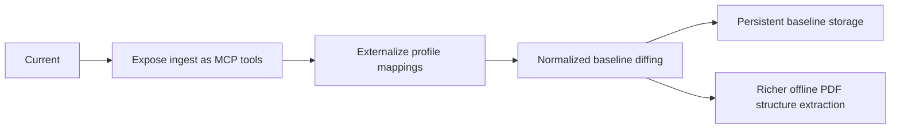
```mermaid
flowchart LR
    NOW[Current] --> NEXT1[Expose ingest as MCP tools]
    NEXT1 --> NEXT2[Externalize profile mappings]
    NEXT2 --> NEXT3[Normalized baseline diffing]
    NEXT3 --> LATER1[Persistent baseline storage]
    NEXT3 --> LATER2[Richer offline PDF structure extraction]
```

Near term:

- expose ingest as MCP tools
- externalize document profiles and header maps from Python into config
- implement normalized requirement diffing across source versions
- publish derived ReqIF, gate summaries, and SARIF artifacts in CI

Later:

- persistent baseline storage
- richer PDF structure extraction with preloaded offline models
- document-family specific distillation profiles beyond AESCSF
- broader repo-security fact extraction and policy coverage
