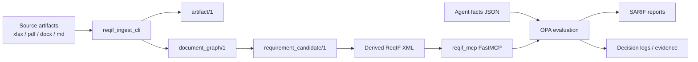

<div align="center">
  <pre>
╔════════════════════════════════════════════════════════════════════╗
║             ReqIF  ->  OPA  ->  SARIF  Compliance Gate            ║
╚════════════════════════════════════════════════════════════════════╝
  </pre>
  <p><em>Deterministic requirements ingestion and policy evaluation with traceable evidence.</em></p>
</div>

## Status

This repo now has two distinct surfaces:

- `reqif_mcp/`
  - FastMCP server for parsing, validating, querying, and exporting existing ReqIF baselines.
  - Verification events are written to the evidence store.
- `reqif_ingest_cli/`
  - Standalone deterministic ingestion pipeline for source artifacts.
  - First-class XLSX support, offline PDF text extraction, derived ReqIF emission, and optional Azure Foundry review hooks.

What exists today:

- ReqIF parse/normalize/query/verification via MCP
- Deterministic source-to-ReqIF derivation for:
  - AESCSF core workbook
  - AESCSF assessment toolkit workbook
  - generic header-driven XLSX
  - text-layer PDFs
  - DOCX and Markdown through `docling`
- Typed test coverage for parser, normalization, SARIF mapping, and ingest

What is still future work:

- Ingest surfaced as MCP tools
- Requirement diffing between successive source versions
- Persistent baseline storage beyond in-memory handles
- End-to-end sample OPA bundles and SARIF upload workflows
- Richer PDF structure extraction with pre-seeded offline Docling models

## Architecture


```mermaid
flowchart LR
    S[Source artifacts<br/>xlsx / pdf / docx / md] --> I[reqif_ingest_cli]
    I --> A[artifact/1]
    I --> G[document_graph/1]
    G --> C[requirement_candidate/1]
    C --> R[Derived ReqIF XML]

    R --> M[reqif_mcp FastMCP]
    F[Agent facts JSON] --> O[OPA evaluation]
    M --> O
    O --> SARIF[SARIF reports]
    O --> LOGS[Decision logs / evidence]
```

The boundary is deliberate:

- ingestion is standalone and deterministic first
- ReqIF remains a derived artifact
- OPA stays the gate, not the extractor

## Quick Start

Root repo:

```bash
just install
just check
just serve
```

Ingest CLI:

```bash
just -f reqif_ingest_cli/justfile check
just -f reqif_ingest_cli/justfile smoke-aemo-core
just -f reqif_ingest_cli/justfile smoke-aemo-toolkit
```

Emit a derived ReqIF from the sample AESCSF core workbook:

```bash
uv run python -m reqif_ingest_cli emit-reqif \
  "samples/aemo/The AESCSF v2 Core.xlsx" \
  --title "AESCSF Core Derived Baseline" \
  --output "/tmp/aescsf-core.reqif" \
  --pretty
```

## Repo Map

- `reqif_mcp/` - FastMCP server and current ReqIF evaluation surface
- `reqif_ingest_cli/` - deterministic artifact intake, extraction, distillation, and ReqIF emission
- `README-reqif-ingest-cli.md` - CLI-specific usage and profiles
- `samples/` - tracked sample inputs and contract fixtures
- `tests/` - parser, normalization, SARIF, and ingest tests

## Current Capabilities

### ReqIF MCP Server

Available tools in `reqif_mcp/server.py`:

- `reqif_parse`
- `reqif_validate`
- `reqif_query`
- `reqif_export_req_set`
- `reqif_write_verification`

Current implementation notes:

- baselines are stored in memory by handle
- ReqIF is accepted as base64 XML input
- HTTP and STDIO transports are supported
- evaluation and evidence are separate from ingestion

### Standalone Ingest CLI

Available commands in `reqif_ingest_cli/__main__.py`:

- `register-artifact`
- `extract`
- `distill`
- `emit-reqif`
- `foundry-config`

Current extraction profiles:

- `aescsf_core_v2`
- `aescsf_toolkit_v1_1`
- `generic_xlsx_table`
- `pdf_docling_v1`
- `docx_docling_v1`
- `markdown_docling_v1`

Current implementation notes:

- XLSX is first-class and deterministic
- PDF prefers `pypdf` for offline text-layer extraction
- `docling` remains the richer path for DOCX and Markdown
- Azure Foundry integration is optional and not part of the deterministic path

See `README-reqif-ingest-cli.md` for command details.

## Samples

Tracked sample source artifacts:

- `samples/aemo/The AESCSF v2 Core.xlsx`
- `samples/aemo/V2 AESCSF Toolkit Version V1-1.xlsx`
- `evidence_store/toolkits/aemo/aescsf-2025-overview.pdf`

Tracked contract fixtures:

- `samples/contracts/requirement-record.example.json`
- `samples/contracts/requirement-candidate.example.json`
- `samples/contracts/agent-facts.example.json`
- `samples/contracts/opa-output.example.json`

Existing ReqIF fixture:

- `tests/fixtures/sample_baseline.reqif`

These sample JSON files are intentionally reusable in tests and docs, so the README does not need to carry large inline blobs.

## Dogfooding With GitHub and Copilot

Recommended CI/CD workflows for this repo:

- Pull request quality gate
  - run `just check`
  - run `just check-ingest`
  - fail fast on parser, schema, or ingest regressions
- Sample artifact smoke run
  - trigger when `samples/**`, `reqif_ingest_cli/**`, or `README-reqif-ingest-cli.md` changes
  - emit derived ReqIF from the tracked AESCSF workbooks
  - upload the derived ReqIF as a build artifact for review
- Future SARIF dogfood
  - trigger when `reqif_mcp/**`, `opa-bundles/**`, or `samples/contracts/**` changes
  - evaluate sample facts against example bundles
  - upload SARIF to GitHub code scanning
- Future baseline drift check
  - trigger on changes to tracked source documents
  - emit ReqIF and compare normalized requirements against the last known baseline

Recommended Copilot usage in this repo:

- treat `justfile` and `reqif_ingest_cli/justfile` as the public command surface
- use `samples/contracts/*.json` instead of inventing ad hoc JSON examples
- update tests first when changing parser or ingest behavior
- keep raw ReqIF XML generation behind the emitter instead of hand-editing XML

## Data Contract Examples

Use the tracked sample JSON files instead of copying fragments out of the README:

- requirement record: `samples/contracts/requirement-record.example.json`
- derived candidate: `samples/contracts/requirement-candidate.example.json`
- agent facts: `samples/contracts/agent-facts.example.json`
- OPA output: `samples/contracts/opa-output.example.json`

## Standards and Formats

- ReqIF 1.2
- SARIF v2.1.0
- OPA bundles and decision logs
- FastMCP

## TODO

Near term:

- expose ingest as MCP tools
- externalize document profiles and header maps from Python into config
- implement normalized requirement diffing across source versions
- add committed example OPA bundles and end-to-end SARIF smoke coverage

Later:

- persistent baseline storage
- richer PDF structure extraction with preloaded offline models
- document-family specific distillation profiles beyond AESCSF
- CI workflows that publish derived ReqIF and SARIF artifacts on every PR
