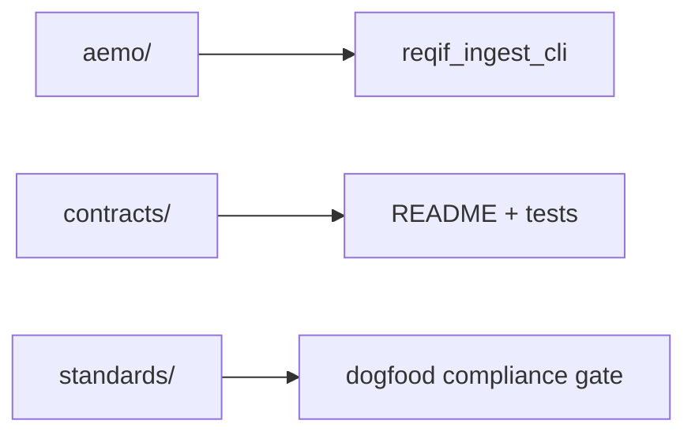

# Samples

Tracked sample assets used by docs, tests, and local dogfooding.

## Index

- `aemo/README.md` - source workbooks used for deterministic ingest smoke runs
- `contracts/README.md` - compact JSON fixtures for contracts and examples
- `standards/README.md` - upstream standards material and derived dogfood baselines

## Layout

- `aemo/`
  - tracked AESCSF source artifacts used by `reqif_ingest_cli`
- `contracts/`
  - small stable JSON fixtures used by docs and tests
- `standards/`
  - upstream standards material plus derived ReqIF samples used by the gate
