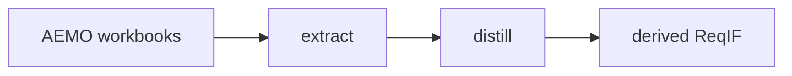

# AEMO Samples

These are tracked source artifacts used to exercise deterministic ingest flows.

## Files

- `The AESCSF v2 Core.xlsx`
  - flat workbook layout used by the `aescsf_core_v2` profile
- `V2 AESCSF Toolkit Version V1-1.xlsx`
  - multi-sheet assessment workbook used by the `aescsf_toolkit_v1_1` profile

## Usage

- `just -f reqif_ingest_cli/justfile smoke-aemo-core`
- `just -f reqif_ingest_cli/justfile smoke-aemo-toolkit`
- `uv run python -m reqif_ingest_cli distill "samples/aemo/The AESCSF v2 Core.xlsx" --pretty`

These files are source artifacts, not policy baselines. ReqIF remains derived from them.
