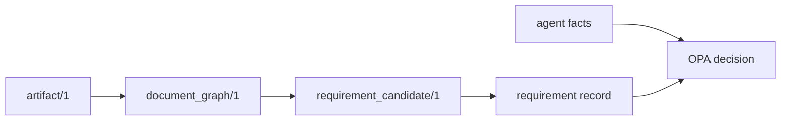

# Contract Samples

These JSON fixtures keep the docs and tests grounded in tracked payloads instead of inline blobs.

## Files

- `requirement-record.example.json`
  - normalized requirement record consumed by the gate
- `requirement-candidate.example.json`
  - deterministic distillation output before ReqIF emission
- `agent-facts.example.json`
  - agent-produced facts and evidence pointers
- `opa-output.example.json`
  - policy decision object returned by OPA

## Usage

- referenced from `README.md`
- validated by `tests/test_samples_json.py`
- safe to reuse in examples, prompts, and test fixtures
