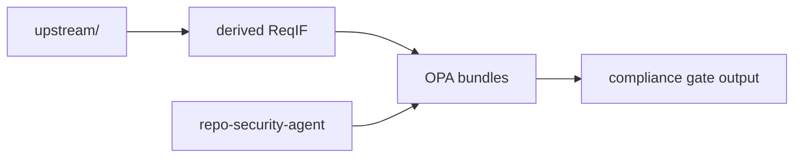

# Standards Samples

These files let the repo dogfood its own compliance gate against concrete security standards samples.

## Layout

- `upstream/owasp-asvs/`
  - source JSON/PDF and provenance for OWASP ASVS material
- `upstream/nist-ssdf/`
  - source PDF/text and provenance for NIST SSDF material
- `derived/owasp_asvs_cwe.reqif`
  - selected ASVS controls mapped to the current repo-security CWE profile
- `derived/nist_ssdf_dogfood.reqif`
  - selected SSDF tasks used for repo process dogfooding

## Related Commands

- `just dogfood-asvs`
- `just dogfood-asvs-cwe CWE-20`
- `just dogfood-ssdf`

These are functional samples. They are intentionally narrow and meant for repo-level gate exercise, not full standards coverage.
